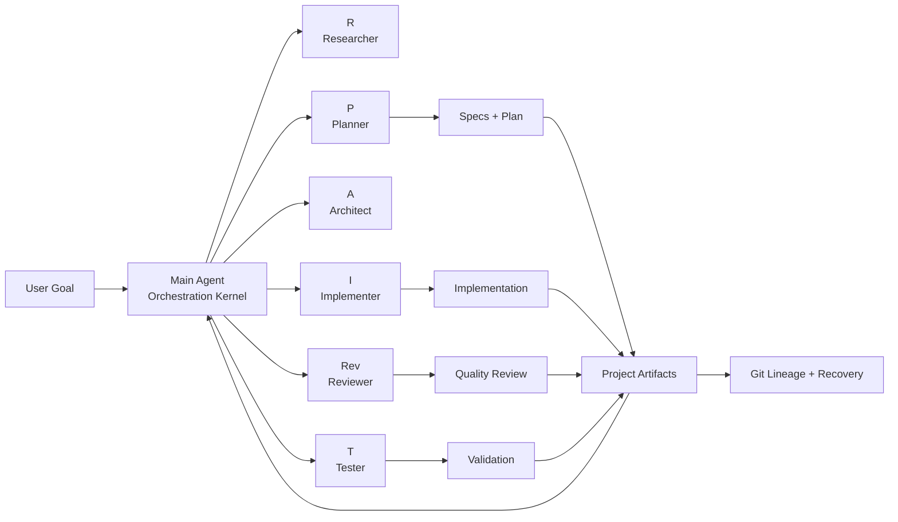
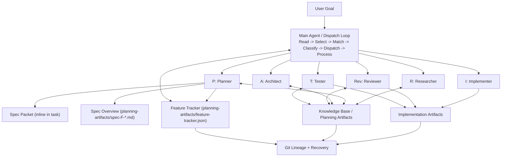

# Claude Code Context Engineering Template

A lightweight, project-agnostic template that turns Claude Code into a context-engineered multi-agent system.

## Content

- [What Is This?](#what-is-this)
- [Project Brief](#project-brief)
- [Quick Start](#quick-start)
- [Architecture](#architecture)
- [How It Works](#how-it-works)
- [Adding Agents](#adding-agents)
- [Project Structure](#project-structure)
- [Design Principles](#design-principles)
- [Context Engineering Framework](#context-engineering-framework)
- [Idea Organization and Prioritization](#idea-organization-and-prioritization)
- [Architectural Decisions Stress-Tested](#architectural-decisions-stress-tested)
- [Why This Matters](#why-this-matters)
- [Resources](#resources)
- [License](#license)

## What Is This?

This template encodes **Context Engineering**: controlling what enters an LLM context, when, in what form, and what stays externalized.

It provides a practical operating model where:

- A **Main Agent** (`CLAUDE.md`) acts as a stateless dispatcher
- **Specialized subagents** handle research, planning, architecture, implementation, review, and testing
- **Skills** provide reusable knowledge loaded on demand
- **Files** act as durable external memory across context compaction
- **Git** provides lineage, checkpoints, and recovery

## Project Brief

This repository is a reusable template focused on orchestration behavior, quality gates, and durable execution context.

It is markdown-first and zero-runtime by design: the core system behavior lives in agent/skill definitions and file conventions, not in application runtime code.

Primary purpose:

- Start new projects with a production-style multi-agent workflow
- Keep context usage controlled under long-running sessions
- Enforce consistent review/verification patterns
- Preserve project state in files that survive session resets

### Executive Diagram



## Quick Start

### Prerequisites
- Git installed
- Claude Code CLI installed

### 1. Clone or download template files

**Option A: Using degit (recommended)**
**Option A: Using degit (recommended - fastest, cross-platform)**
```bash
npx degit vospr/context-engineering-template my-project
cd my-project
git init
```

**Option B: Using git clone**
```bash
git clone https://github.com/vospr/context-engineering-template.git my-project
cd my-project
rm -rf .git
git init
```

### 2. Customize placeholder skills (Required)
rm -rf .git  # Remove template git history
git init     # Start fresh repository
```

**Option C: Manual download**
1. Download repository as ZIP from GitHub
2. Extract to your project directory
3. Keep: `CLAUDE.md`, `.claude/` folder, `.gitignore`

### 2. Customize placeholder skills (Required)

Four files in `.claude/skills/` are marked `[PLACEHOLDER]` and **must be customized**:

```bash
.claude/skills/coding-standards.md        # Your language, linter, patterns
.claude/skills/review-checklist.md        # Your test commands, quality bar
.claude/skills/testing-strategy.md        # Your test framework, coverage
.claude/skills/architecture-principles.md # Your system constraints, design
```

Customize these files for your stack:

```bash
.claude/skills/coding-standards.md
.claude/skills/review-checklist.md
.claude/skills/testing-strategy.md
.claude/skills/architecture-principles.md
```

Validation check:

```bash
grep -r "\[PLACEHOLDER\]" .claude/skills/
```

### 3. Start Claude Code

```bash
claude
```
**Quick validation**:
```bash
# Should return no results if customization is complete
grep -r "\[PLACEHOLDER\]" .claude/skills/
```

**Example stacks** (customize skills for):
- Python/Django, Node.js/Express, React/TypeScript, Go microservices, etc.

### 3. Verify structure
```bash
# Should show CLAUDE.md and .claude/
ls -la

# Should list 8 files (6 agents + template + CLAUDE.md index)
ls .claude/agents/

# Should list 7 files (6 skills + CLAUDE.md index)
ls .claude/skills/
```

### 4. Start Claude Code
```bash
claude
```

The Main Agent reads CLAUDE.md automatically and begins the dispatch loop.

## Architecture

```
User Goal
  -> Dispatch Loop classifies complexity + spec_tier
  -> Planner authors spec (inline packet + feature overview)
  -> Implementer executes against assertions
  -> Post-task audit + Reviewer validation
  -> Feature tracker updates continuity state
  -> Next task dispatch
```



**[R]**esearcher - **[P]**lanner - **[A]**rchitect - **[I]**mplementer - **[Rev]**iewer - **[T]**ester

### Architectural Anchor

SDD is an external, verifiable, decomposable definition of done that survives context loss and keeps specification cost below ambiguity cost.

### Delivery Model (Thin Vertical Slice)

- **Slice 1 (MVP Pipeline):** minimum spec packet + controlled vocabulary + inline assertions + post-task audit
- **Slice 2 (Track & Continue):** feature tracker for continuity and zero-handoff resumption
- **Slice 3 (Govern & Verify):** constitution/gates (optional), two-layer verification, escalation
- **Slice 4 (Scale & Extend):** permanent agent extensions (planner spec authoring, reviewer spec review, tester assertion/integration modes), reusable spec templates, agent-specific spec views, metrics dashboard

### Key Architecture Decisions

- **ADR-001:** YAML spec packets + markdown feature overviews
- **ADR-002:** skill-first spec authoring, permanent agent extension deferred
- **ADR-003:** inline assertion verification first, then two-layer verification
- **ADR-004:** JSON feature tracker as continuity index
- **ADR-005:** progressive governance from lightweight protocol to optional constitution

### Dispatch Integration (SDD Mode)

- SDD activates when `spec-protocol.md` is present
- Dispatch loop adds spec-aware routing (`spec_tier`) on top of model routing
- Planner can be auto-dispatched to spec next unverified feature when task queue is empty
- `NEEDS_RESPEC` feedback triggers planner re-spec of affected subtree

### File Organization Rules

- Spec packets are embedded inline in task descriptions (no extra read hops for execution)
- Spec overviews are flat files in `planning-artifacts/` with `spec-F-{NNN}-{name}-overview.md` naming
- Feature progress state is tracked in `planning-artifacts/feature-tracker.json`

## How It Works

### The Dispatch Loop (CLAUDE.md)
1. **Read** current state from task system and artifacts
2. **Select** next unblocked task
3. **Match** task to best-fit specialized agent
4. **Classify** complexity and choose model level
5. **Dispatch** task with relevant context paths
6. **Process** result and update status
7. **Repeat** with periodic compaction/token checks

### Communication Patterns
| Pattern | When | How |
|---------|------|-----|
| One-Shot | Default | Single agent completes task independently |
| Worker-Reviewer | Implementation | Implementer <-> Reviewer loop, max 3 cycles |
| Parallel Fan-Out | Multi-perspective | Agents run in parallel on non-overlapping files |

### Token Budget
- Main Agent target: **<128k tokens** for end-to-end work
- Proactive compaction around **80k**
- Decisions/state persisted to files immediately
- Model economics: sonnet default, opus for complex architecture, haiku for lightweight tasks

### Token Usage Optimization via RAG

The template uses a multi-layer RAG (Retrieval-Augmented Generation) strategy that reduces research token consumption by **60-80%**. The researcher agent follows a local-first priority chain:

1. **Research artifact reuse** — Grep existing reports (<7 days old) before any web call
2. **Knowledge base** — Check curated topic files in `planning-artifacts/knowledge-base/`
3. **Context7 MCP** — Query library and framework documentation via `resolve-library-id` + `get-library-docs`
4. **Tavily MCP** — RAG-optimized web search with pre-summarized results (see `.claude/skills/tavily-setup.md`)
5. **WebSearch + WebFetch** — Raw fallback only when all other sources are insufficient

Directory index files (`CLAUDE.md`) in key folders provide lightweight semantic maps so agents understand project structure without scanning all files (~200 tokens vs ~5000+).

## Adding Agents

Add a new `.md` file in `.claude/agents/` following `_agent-template.md`. The Main Agent discovers agents by directory scan.

## Project Structure

```
project-root/
├── CLAUDE.md                                    # Dispatch loop kernel (+3 lines for SDD)
├── README.md                                    # Project documentation
├── .gitignore                                   # Includes .env*, credentials.*, secrets/
│
├── .claude/
│   ├── agents/                                  # Self-discovering agent pool
│   │   ├── researcher.md                        # Web search, tech evaluation
│   │   ├── planner.md                           # Task DAG + spec authoring (Slice 4: permanent extension)
│   │   ├── architect.md                         # System design, tech selection
│   │   ├── implementer.md                       # Code writing, file editing
│   │   ├── reviewer.md                          # Code review + spec review (Slice 4: dual mode)
│   │   └── tester.md                            # Test execution + assertion execution (Slice 4: triple mode)
│   │
│   ├── skills/
│   │   ├── spec-protocol.md                     # [NEW: Slice 1] SDD core — format, vocabulary, assertions, governance seed
│   │   ├── coding-standards.md                  # Existing project-specific coding rules
│   │   ├── review-checklist.md                  # Review quality gate checklist
│   │   ├── testing-strategy.md                  # Existing testing approach
│   │   └── architecture-principles.md           # Architecture constraints and principles
│   │
│   └── spec-templates/                          # [NEW: Slice 4, optional] Reusable spec patterns
│       ├── rest-crud-endpoint.yaml              # Template for REST CRUD features
│       ├── auth-flow.yaml                       # Template for auth features
│       └── data-pipeline.yaml                   # Template for data processing features
│
├── planning-artifacts/
│   ├── feature-tracker.json                     # [NEW: Slice 2] Feature-level progress index
│   ├── constitution.md                          # [NEW: Slice 3, optional] Immutable project principles
│   ├── spec-F-001-{name}-overview.md            # [NEW: Slice 1] Per-feature spec overviews
│   ├── spec-F-002-{name}-overview.md
│   ├── decisions.md                             # Architectural/technology decision log
│   ├── project-status.md                        # Current phase, milestones, blockers
│   ├── session-context.md                       # Token compaction summaries
│   └── knowledge-base/                          # Shared context artifacts between agents
│       ├── README.md
│       └── failure-patterns.md                  # [NEW: Slice 3] Learning from past failures
│
├── implementation-artifacts/
│   └── (created at runtime by implementer/reviewer/tester)
│
└── docs/                                        # Project documentation (if applicable)
CLAUDE.md                              # Main Agent dispatch kernel (~141 lines)
.claude/
  agents/                              # Subagent definitions
    CLAUDE.md                          # Directory index (agent inventory)
    _agent-template.md                 # Convention template
    researcher.md                      # Local-first RAG + web research (haiku)
    planner.md                         # Task DAG creation (sonnet)
    architect.md                       # System design (opus)
    implementer.md                     # Code writing (sonnet)
    reviewer.md                        # Code review (sonnet, read-only)
    tester.md                          # Test execution (sonnet)
  skills/                              # Reusable knowledge modules
    CLAUDE.md                          # Directory index (skill inventory)
    git-workflow.md                    # Universal git conventions
    tavily-setup.md                    # Tavily MCP setup for RAG-optimized search
    coding-standards.md                # [PLACEHOLDER] language/framework
    review-checklist.md                # [PLACEHOLDER] review criteria
    testing-strategy.md                # [PLACEHOLDER] test framework
    architecture-principles.md         # [PLACEHOLDER] design constraints
  settings.json                        # Hooks for secret detection
.gitignore                             # Security defaults
planning-artifacts/                    # Created at runtime
  CLAUDE.md                            # Directory index (artifact types)
  knowledge-base/                      # Persistent RAG cache (version-controlled)
    README.md                          # Knowledge base guidelines
    rag-sources.md                     # RAG layer reference doc
implementation-artifacts/              # Created at runtime
```

## Design Principles

1. **Stateless Dispatcher** - Main Agent stores no durable state in memory
2. **Delegated Mechanism Selection** - Subagents choose tools/mechanisms for their tasks
3. **File System as Memory** - Project context externalized to files
4. **Git as Lineage** - Recoverable history and checkpointing
5. **Graduated Context Loading** - Kernel + skills + on-demand files
6. **Self-Discovering Agent Pool** - Directory is registry

## Context Engineering Framework

This template implements six operational principles derived from context engineering research:

### 1. Context Offloading
Project state persists in files outside the context window - `planning-artifacts/`, `implementation-artifacts/`, and a decisions log. Git micro-commits act as checkpoints and provide recoverable lineage.

### 2. Context Retrieval
The Main Agent reads only what it needs: TaskList + latest artifacts. Agents load skills on demand via `setting_sources` and `skills` fields. New agents add themselves by dropping a file in `.claude/agents/` - no configuration changes required.

### 3. Context Reduction
A <128k token budget keeps the Main Agent compact across entire projects. Complexity classification routes simple lookups to haiku and reserves expensive models for architecture decisions. Task decomposition caps each unit at 3-5 files. Proactive compaction at 80k summarizes older turns.

### 4. Context Isolation
Six specialized agents run in separate contexts with only the tools they need. Parallel fan-out dispatches multiple agents on non-overlapping files. All implementation stays on feature branches, never main.

### 5. Context Orchestration
One universal dispatch pattern governs every project stage: read -> match agent -> classify complexity -> dispatch -> process result -> repeat. Three communication modes handle different scenarios (one-shot, worker-reviewer loop, parallel fan-out).

### 6. Context Governance
Reviewers follow a structured protocol: STATUS codes, numbered issues with severity ratings, and specific fix guidance for every finding. Circuit breaker caps worker-reviewer iterations at three cycles. Secret leak prevention operates in three layers: file exclusion, agent constraints, and automated hooks.

Reference links:

- `CLAUDE.md`
- `.claude/agents/_agent-template.md`
- `.claude/agents/planner.md`
- `.claude/agents/researcher.md`
- `.claude/agents/reviewer.md`
- `.claude/settings.json`
- `.claude/skills/git-workflow.md`
- `.gitignore`

## Idea Organization and Prioritization

The template was designed through a comprehensive brainstorming session using three techniques (First Principles Thinking, Morphological Analysis, Chaos Engineering), producing 50 design contexts organized into six context engineering themes.

### Context Offloading: File System as Externalized Memory

How project state is persisted outside the context window - `planning-artifacts/`, `implementation-artifacts/`, decisions log; Git = recoverable lineage

- **Structured status as markdown at known paths** - `CLAUDE.md:67-85` (Folder Conventions)
- **Git branch per feature for lineage** - `CLAUDE.md:120-125` (Git Workflow section)
- **Two-phase artifacts: planning -> implementation** - `CLAUDE.md:69-70`
- **Dual state architecture: Tasks for flow, Files for memory** - `.claude/agents/planner.md:4` + `CLAUDE.md:67-85`
- **Decisions written to files immediately** - `CLAUDE.md:8,111-113` (Principle 3)
- **Git micro-commits as checkpoints** - `.claude/skills/git-workflow.md:34-41`
- **Branch isolation - agents never work on main** - `CLAUDE.md:121`
- **Knowledge base as persistent RAG cache** - `planning-artifacts/knowledge-base/` (version-controlled, survives sessions)
- **Directory CLAUDE.md indexes as semantic maps** - `.claude/agents/CLAUDE.md`, `.claude/skills/CLAUDE.md`, `planning-artifacts/CLAUDE.md`

### Context Retrieval: Read Current State Each Cycle

- **Stateless Dispatcher** - `CLAUDE.md:6` (Principle 1: "Stateless")
- **Minimal Read Window** - `CLAUDE.md:14-16` (latest + next step only)
- **Task DAG for routing and dependencies** - `.claude/agents/planner.md:1-69`
- **Graduated context loading via setting_sources + skills** - `.claude/agents/_agent-template.md:6-7`
- **Self-discovering agent pool** - `CLAUDE.md:22-29`
- **Local-first RAG priority chain** - `.claude/agents/researcher.md:21-41`

### Context Reduction: Token Budget + Compaction + RAG

- **North Star: ship simple app in one 128k window** - `CLAUDE.md:9`
- **Compaction at 80k** - `CLAUDE.md:45-47,107-109`
- **Proactive compaction every 5 tasks** - `CLAUDE.md:45-47`
- **CLAUDE.md max 200 lines** - `CLAUDE.md:136-141`
- **Complexity classification for model selection** - `CLAUDE.md:31-34`
- **Task decomposition rule: 3-5 files max per task** - `.claude/agents/planner.md:26-30`

### Context Isolation: Specialized Subagents + Parallel Execution

- **Delegated Mechanism Selection** - `.claude/agents/_agent-template.md:4-8`
- **Worker-Reviewer autonomous quality loop** - `CLAUDE.md:54-59`
- **Parallel fan-out pattern** - `CLAUDE.md:61-65`
- **Dependency analysis prevents parallel file conflicts** - `.claude/agents/planner.md:20-23`

### Context Governance: Quality Gates + Security Controls

- **Hooks as automated quality gates** - `.claude/settings.json:2-14`
- **Circuit breaker: max 3 review cycles** - `CLAUDE.md:58-59,96-97`
- **Structured feedback protocol** - `CLAUDE.md:89-93` + `.claude/agents/reviewer.md:23-49`
- **MCP fallback chain** - `CLAUDE.md:131`
- **Secret leak defense layers** - `.gitignore:1-11` + `.claude/settings.json:3-12`

### Context Orchestration: Stateless Dispatcher Loop

- **Main Agent dispatches all stages** - `CLAUDE.md:7`
- **One universal dispatch pattern** - `CLAUDE.md:12-47`
- **Two-level split: Main Agent rules vs Subagent rules** - `CLAUDE.md` + `.claude/agents/*.md`

## Architectural Decisions Stress-Tested

The template architecture is designed for resilience against common failure classes:

- Context overflow
- Infinite review loops
- Parallel file conflicts
- Tooling/server failures
- Session interruption
- Secret leakage
- Cost runaway

## Why This Matters

Reliable multi-session delivery requires structured context, not just model capability. This template provides a practical baseline for predictable orchestration and recoverable project execution.

## Resources

- `CLAUDE.md`
- `.claude/agents/`
- `.claude/skills/`
- `planning-artifacts/`
- `implementation-artifacts/`

## Context Engineering Framework

This template implements six operational principles derived from context engineering research:

### 1. Context Offloading
Project state persists in files outside the context window — `planning-artifacts/`, `implementation-artifacts/`, and a decisions log. Git micro-commits act as checkpoints and provide recoverable lineage.

### 2. Context Retrieval
The Main Agent reads only what it needs: TaskList + latest artifacts. Agents load skills on demand via `setting_sources` and `skills` fields. New agents add themselves by dropping a file in `.claude/agents/` — no configuration changes required.

### 3. Context Reduction
A <128k token budget keeps the Main Agent compact across entire projects. Complexity classification routes simple lookups to haiku and reserves expensive models for architecture decisions. Task decomposition caps each unit at 3-5 files. Proactive compaction at 80k summarizes older turns.

### 4. Context Isolation
Six specialized agents run in separate contexts with only the tools they need. Parallel fan-out dispatches multiple agents on non-overlapping files. All implementation stays on feature branches, never main.

### 5. Context Orchestration
One universal dispatch pattern governs every project stage: read → match agent → classify complexity → dispatch → process result → repeat. Three communication modes handle different scenarios (one-shot, worker-reviewer loop, parallel fan-out).

### 6. Context Governance
Reviewers follow a structured protocol: STATUS codes, numbered issues with severity ratings, and specific fix guidance for every finding. Circuit breaker caps worker-reviewer iterations at three cycles. Secret leak prevention operates in three layers: file exclusion, agent constraints, and automated hooks.

## Idea Organization and Prioritization

The template was designed through a comprehensive brainstorming session using three techniques (First Principles Thinking, Morphological Analysis, Chaos Engineering), producing 50 design contexts organized into six context engineering themes.

### Context Offloading: File System as Externalized Memory

How project state is persisted outside the context window — `planning-artifacts/`, `implementation-artifacts/`, decisions log; Git = recoverable lineage

- **Structured status as markdown at known paths** — `CLAUDE.md:67-85` (Folder Conventions)
- **Git branch per feature for lineage** — `CLAUDE.md:120-125` (Git Workflow section)
- **Two-phase artifacts: planning → implementation** — `CLAUDE.md:69-70`
- **Dual state architecture: Tasks for flow, Files for memory** — `.claude/agents/planner.md:4` + `CLAUDE.md:67-85`
- **Decisions written to files immediately** — `CLAUDE.md:8,111-113` (Principle 3)
- **Git micro-commits as checkpoints** — `.claude/skills/git-workflow.md:34-41`
- **Branch isolation — agents never work on main** — `CLAUDE.md:121`
- **Knowledge base as persistent RAG cache** — `planning-artifacts/knowledge-base/` (version-controlled, survives sessions)
- **Directory CLAUDE.md indexes as semantic maps** — `.claude/agents/CLAUDE.md`, `.claude/skills/CLAUDE.md`, `planning-artifacts/CLAUDE.md`

### Context Retrieval: Read Current State Each Cycle

How the Main Agent loads exactly what it needs — TaskList + latest artifacts; load "skills" modules on demand; multi-layer RAG for research

- **Stateless Dispatcher** — `CLAUDE.md:6` (Principle 1: "Stateless")
- **Minimal Read Window** — `CLAUDE.md:14-16` (latest + next step only)
- **Current state for routing, git for time-travel** — `CLAUDE.md:14-16`
- **Task DAG for routing and dependencies** — `.claude/agents/planner.md:1-69` (entire agent dedicated to DAG)
- **Graduated context loading via setting_sources + skills** — `.claude/agents/_agent-template.md:6-7`
- **Skills as reusable externalized knowledge modules** — `.claude/skills/git-workflow.md:1-57` (universal)
- **Full resumability from cold start** — `CLAUDE.md:6,127-134` (Session Initialization)
- **Self-discovering agent pool** — `CLAUDE.md:22-29` (reads .claude/agents/ directory)
- **Local-first RAG priority chain** — `.claude/agents/researcher.md:21-41` (artifacts → knowledge-base → Context7 → Tavily → web)
- **Context7 MCP for library docs** — `.claude/agents/researcher.md:4,33-37` (resolve-library-id + get-library-docs)
- **Research artifact reuse (<7 days)** — `.claude/agents/researcher.md:25-27` (temporal RAG cache)

### Context Reduction: Token Budget + Compaction + RAG

How the template stays within 128k tokens — proactive compaction at ~80k; summarize older turns → session-context.md; multi-layer RAG reduces research tokens by 60-80%

- **North Star: ship simple app in one 128k window** — `CLAUDE.md:9` (Principle 4)
- **Compaction at 80k: summarize oldest 20 turns → JSON, keep last 3 raw** — `CLAUDE.md:45-47,107-109`
- **Proactive compaction every 5 tasks** — `CLAUDE.md:45-47`
- **CLAUDE.md max 200 lines — kernel must be small** — `CLAUDE.md:136-141`
- **Complexity classification for model selection** — `CLAUDE.md:31-34` (Step 4)
- **Task decomposition rule: 3-5 files max per task** — `.claude/agents/planner.md:26-30`
- **Default sonnet, escalate to opus only when needed** — `CLAUDE.md:115-118`
- **Multi-layer RAG reduces research tokens 60-80%** — `.claude/agents/researcher.md:21-45` (local-first priority chain)
- **Directory indexes (~200 tokens) replace full directory scans (~5000+ tokens)** — `.claude/agents/CLAUDE.md`, `.claude/skills/CLAUDE.md`, `planning-artifacts/CLAUDE.md`
- **Tavily MCP returns pre-summarized results** — `.claude/skills/tavily-setup.md` (RAG-optimized vs raw WebFetch)

### Context Isolation: Specialized Subagents + Parallel Execution

How work is compartmentalized — specialized subagents with dedicated context; parallel fan-out on non-overlapping files; feature branch isolation

- **Delegated Mechanism Selection** — subagents choose tools/model — `.claude/agents/_agent-template.md:4-8`
- **Embedded CTO** — only 6 agents, no separate technical agent — `.claude/agents/` (researcher, planner, architect, implementer, reviewer, tester)
- **Worker-Reviewer autonomous quality loop** — `CLAUDE.md:54-59` (Pattern 2)
- **Multi-Perspective Final Review** — `CLAUDE.md:61-65` (Pattern 3: Parallel Fan-Out)
- **Custom agents in .claude/agents/ with YAML frontmatter** — `.claude/agents/_agent-template.md:1-9`
- **Agent Teams for worker-reviewer iteration** — `CLAUDE.md:54-59` (worker-reviewer dispatch)
- **Model heuristic: haiku/sonnet/opus by role and complexity** — `CLAUDE.md:31-34`
- **Three communication primitives** — `CLAUDE.md:49-65` (one-shot, team, fan-out)
- **Dependency analysis prevents parallel file conflicts** — `.claude/agents/planner.md:20-23`
- **Agent template with mandatory convention sections** — `.claude/agents/_agent-template.md:1-34`
- **Description-based matching scales to any pool size** — `CLAUDE.md:22-29`

### Context Governance: Quality Gates + Security Controls

How the template prevents bugs and maintains standards — reviewer protocol, max 3 review cycles; secret-leak prevention hooks

- **Hooks (PreToolUse/PostToolUse) as automated quality gates** — `.claude/settings.json:2-14`
- **Circuit breaker: max 3 review cycles → blocked status** — `CLAUDE.md:58-59,96-97`
- **Structured feedback protocol: STATUS/ISSUES/SEVERITY/FIX_GUIDANCE** — `CLAUDE.md:89-93` + `.claude/agents/reviewer.md:23-49`
- **MCP fallback chain: MCP → CLI → built-in → report blocked** — `CLAUDE.md:131`
- **MCP 30-second timeout, max 1 retry** — `CLAUDE.md:129`
- **MCP failure invisible to Main Agent (isolation)** — `CLAUDE.md:130-131`
- **MCP health check at session start** — `CLAUDE.md:129-131`
- **ARCHITECTURE_IMPACT flag triggers DAG rebuild** — `CLAUDE.md:43`
- **Secret leak defense: .gitignore + agent rules + hooks** — `.gitignore:1-11` + `.claude/settings.json:3-12`
- **Task DAG blocks dependents until completion verified** — `CLAUDE.md:15,19`

### Context Orchestration: Stateless Dispatcher Loop

How the Main Agent coordinates all work — read → match agent → dispatch → read result; complexity → model choice

- **Main Agent dispatches ALL stages to subagents** — `CLAUDE.md:7` (Principle 2)
- **Template = instruction patterns, not code** — `README.md:7` (encodes Context Engineering)
- **User as ultimate orchestrator** — `CLAUDE.md:19-20`
- **One Universal Dispatch Pattern across all stages** — `CLAUDE.md:12-47`
- **Two-level split: Main Agent rules vs Subagent rules** — `CLAUDE.md:1-141` + `.claude/agents/*.md`
- **Template = CLAUDE.md + .claude/agents/ + .claude/skills/ + folder convention** — `README.md:91-114`
- **Skills as configurable templates with placeholders** — `README.md:22-28` + `.claude/skills/`

## Implementation Priority

| Priority | Deliverable | Size | Key Principles |
|----------|-------------|------|-----------------|
| 1 | CLAUDE.md — Main Agent dispatch rules | ~141 lines | Orchestration, Retrieval, Reduction |
| 2 | .claude/agents/ — 6 agent definitions + index | ~50-82 lines each | Isolation, Retrieval, Governance |
| 3 | .claude/skills/ — 6 knowledge modules + index | ~30-61 lines each | Retrieval, Orchestration, Reduction |
| 4 | _agent-template.md — convention template | ~34 lines | Isolation |
| 5 | planning-artifacts/knowledge-base/ — RAG cache | persistent | Retrieval, Reduction |
| 6 | .claude/settings.json — Hooks & MCP | ~15 lines | Governance |
| 7 | .gitignore — Security defaults | ~60 lines | Governance, Offloading |
| 8 | README.md — Setup & architecture | this file | Orchestration (all themes) |

**Breakthrough Concept:** The Main Agent's entire instruction set is ONE universal loop — read TaskList → match agent → dispatch → read result → update status → repeat. This makes CLAUDE.md tiny, stable, and KV-cache-friendly.

## Architectural Decisions Stress-Tested

The template was designed through three brainstorming techniques:

- **First Principles Thinking** — 15 core axioms derived from context window economics and token budgets
- **Morphological Analysis** — 12 design dimensions mapping the full parameter space under 128k constraint
- **Chaos Engineering** — 23 failure scenarios stress-tested with concrete fixes for each

Key resilience patterns:

| Failure Mode | Fix |
|--------------|-----|
| Context overflow | Proactive compaction at 80k, every 5 tasks |
| Infinite review loops | Circuit breaker: max 3 cycles → blocked status |
| Parallel file conflicts | Dependency analysis + git branch isolation |
| MCP server failures | Fallback chain: MCP → CLI → built-in → report blocked |
| Session death mid-project | Stateless dispatch + files = full resumability |
| Secret leaks | Three-layer defense: .gitignore + agent rules + hooks |
| Subagent context overflow | Task decomposition: 3-5 files max per task |
| Partial work lost on crash | Git micro-commits as checkpoints |
| Task DAG becomes stale | ARCHITECTURE_IMPACT flag triggers replanning |
| Human-agent race condition | Branch isolation — agents never work on main |
| Cost runaway (opus overuse) | Default sonnet, escalate to opus only when needed |
| Research token waste | Local-first RAG: artifacts → knowledge-base → Context7 → Tavily → web |

## Why This Matters

AI coding assistants write functions and refactor modules, but building complete features across sessions requires more than capability — it requires structured context. Context engineering addresses the gap. As Claude Code, OpenAI Codex, Cursor and Windsurf converge on multi-agent orchestration, this template provides a proven pattern for:

- Coordinating specialized agents without context drift
- Managing token budgets across multi-day projects
- Recovering instantly from failures via git lineage
- Scaling from 6 to unlimited agents without architecture changes

## Resources

- **Gartner (July 2025):** "Context engineering is in, and prompt engineering is out"
- **Philipp Schmid (June 30, 2025):** "The discipline of designing and building dynamic systems that provide the right information and tools, in the right format, at the right time"
- **Anthropic:** Effective context engineering for AI agents — official framework and principles
- **Model Context Protocol:** Universal standard for connecting agents to enterprise tools (97M+ monthly SDK downloads)

## License

MIT
