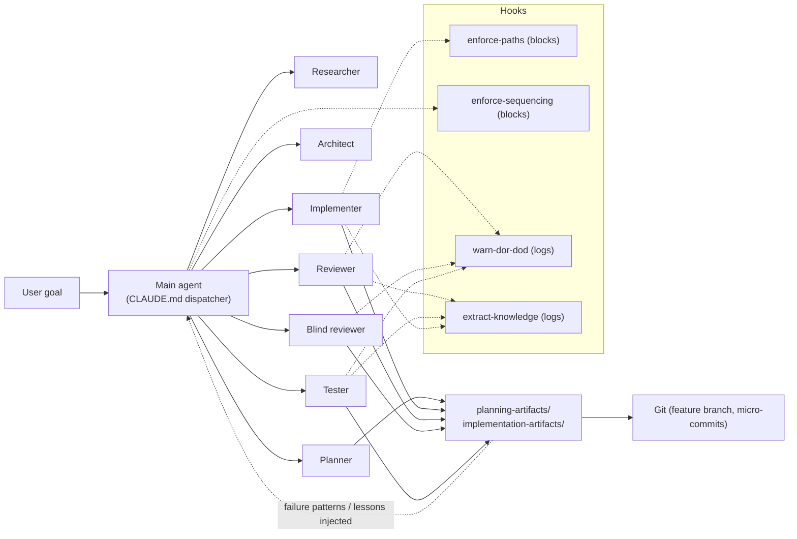

# Claude Code Context Engineering Template

A Claude Code project template for multi-agent delivery. A stateless dispatcher (`CLAUDE.md`) routes work to seven role
agents. Planning, decisions and failure patterns live in files, and review loops have hard stop conditions.
Built February–April 2026.

## Content

- [Status and lineage](#status-and-lineage)
- [What is in the template](#what-is-in-the-template)
- [Quick start](#quick-start)
- [How it works](#how-it-works)
- [Hooks](#hooks)
- [Skills and coding standards](#skills-and-coding-standards)
- [Scenario comparison (Feb 2026)](#scenario-comparison-feb-2026)
- [Checks and evidence](#checks-and-evidence)
- [Known limits](#known-limits)
- [License](#license)

## Status and lineage

**This is a dated build, frozen apart from one revision. It is not a current or maintained tool.** It was built in 41 commits on 8 days between
2026-02-06 and 2026-04-07 (`git log --all`). It was then revised once, on 2026-10-01 (branch `redo-2026-10`), to fix
the hooks, move skills to the current format, pin external inputs, restore the benchmark, and remove claims the repo
could not back. Claude Code has moved on since April 2026, notably with scripted multi-agent workflows and plugins.
Today the dispatch loop would be written as a workflow script and shipped as a plugin; that rebuild has not been done.

Where the parts come from:

- **Core design (Feb–Mar 2026), the author's synthesis.** The stateless dispatcher, file-based memory, role agents,
  blind reviewer, circuit breakers and spec-driven development protocol. They draw on published context-engineering
  writing rather than on one project. February planning used the BMAD method; those outputs are no longer tracked
  (commit `a9b4887`, `.gitignore`).
- **April 2026 hardening, adapted from [Atelier Pipeline](https://github.com/robertsfeir/atelier-pipeline).**
  Commit `d6d31e0` (2026-04-07, "Atelier-inspired") added the triage consensus matrix, step sizing gate,
  research pre-flight and max-turns-per-tier to `CLAUDE.md`. The earlier README also credited Atelier for the
  enforcement hooks, pipeline sizing, adversarial review and knowledge injection. Files that credit a specific Atelier
  version or ADR:
  - `.claude/hooks/extract-knowledge.sh`: brain-extractor idea, Atelier v3.24.0
  - `.claude/skills/observation-masking/SKILL.md`: Atelier ADR-0011
  - `.claude/skills/agent-compression-guide/SKILL.md`: Atelier v3.21.0
- **Community coding rules from [awesome-cursorrules](https://github.com/PatrickJS/awesome-cursorrules) (CC0-1.0).**
  Three rule files are vendored at a pinned commit; see [Skills and coding standards](#skills-and-coding-standards).

## What is in the template

| Path | What |
|---|---|
| [CLAUDE.md](CLAUDE.md) | Dispatch loop: read state → pick task → match agent → size task → dispatch → process result |
| [.claude/agents/](.claude/agents/) | 7 agents: researcher, planner, architect, implementer, reviewer, blind-reviewer, tester (+ `_agent-template.md`) |
| [.claude/skills/](.claude/skills/) | 10 skills, each `<name>/SKILL.md` |
| [.claude/hooks/](.claude/hooks/) | 4 hooks + `lib.sh`, registered in [.claude/settings.json](.claude/settings.json) |
| [.claude/enforcement-config.json](.claude/enforcement-config.json) | Write allowlist used by `enforce-paths.sh` |
| [coding-standards-sources.yaml](coding-standards-sources.yaml) | Language → local coding-rule files |
| [planning-artifacts/](planning-artifacts/) | File-based memory: pipeline state, decisions, [knowledge base](planning-artifacts/knowledge-base/) |
| [benchmarks/scenario-comparison/](benchmarks/scenario-comparison/) | Feb 2026 with/without comparison, restored |
| [checks/](checks/) | Acceptance checks for this revision |
| [evidence/](evidence/) | Recorded check runs and the live hook run |

## Quick start

Prerequisites: git, the Claude Code CLI, `bash` and `jq` (the hooks fall back to grep without `jq`, but the checks need it).

```bash
git clone https://github.com/vospr/context-engineering-template.git my-project
cd my-project && rm -rf .git && git init
```

Then:

1. Customise the template skills for your stack: `.claude/skills/review-checklist/SKILL.md`,
   `.claude/skills/testing-strategy/SKILL.md`, `.claude/skills/architecture-principles/SKILL.md`.
2. Add your source directories to `project_source_dirs` in `.claude/enforcement-config.json`, or the
   `enforce-paths` hook will block the implementer from writing code.
3. Run `bash checks/run.sh` to confirm the hooks behave in your environment, then start `claude`.

## How it works


```mermaid
flowchart LR
    U["User goal"] --> M["Main agent<br/>(CLAUDE.md dispatcher)"]
    M --> R["Researcher"] & P["Planner"] & A["Architect"] & I["Implementer"] & RV["Reviewer"] & BR["Blind reviewer"] & T["Tester"]
    P & I & RV & BR & T --> O["planning-artifacts/<br/>implementation-artifacts/"]
    O --> G["Git (feature branch, micro-commits)"]
    O -.->|"failure patterns / lessons injected"| M
    subgraph Hooks
      EP["enforce-paths (blocks)"]
      ES["enforce-sequencing (blocks)"]
      DD["warn-dor-dod (logs)"]
      EK["extract-knowledge (logs)"]
    end
    I -.-> EP
    M -.-> ES
    RV & BR & T -.-> DD
    RV & T & I -.-> EK
```

The dispatch loop is described in full in [CLAUDE.md](CLAUDE.md). In short:

- **Sizing.** Each task is classified Micro / Small / Medium / Large
  ([pipeline-sizing](.claude/skills/pipeline-sizing/SKILL.md)). Size sets the model tier and pipeline depth: Micro runs
  the implementer only on haiku; Large runs architect (opus) → planner → implementer → reviewer + blind reviewer → tester.
- **Review.** The reviewer returns `STATUS: APPROVED | NEEDS_CHANGES | BLOCKED` with numbered, severity-rated issues.
  For Medium/Large tasks a blind reviewer, told to use only the diff, runs in parallel. A 9-cell table in
  `CLAUDE.md` resolves disagreements. After 3 `NEEDS_CHANGES` cycles the task is set to BLOCKED and goes to the user.
- **Memory.** Decisions, pipeline state and failure patterns are written to files. Patterns seen 3 or more times are
  injected into later agent prompts as warnings.
- **Spec-driven mode.** Present by default via [spec-protocol](.claude/skills/spec-protocol/SKILL.md) (1,450+ lines).
  It adds spec packets, assertions and a feature tracker.

These are instructions to the model. Apart from the hooks below, nothing enforces them mechanically, and this repo does
not measure how reliably a model follows them.

## Hooks

The hooks use the current Claude Code hook contract (checked against the hooks reference on 2026-10-01; see
`.claude/hooks/lib.sh`). The event arrives as JSON on stdin, and `exit 2` blocks a tool call with stderr shown to Claude.
`SubagentStop` output on exit 0 never reaches the model, so the two advisory hooks write to files that `CLAUDE.md`
step 6a tells the dispatcher to read.

| Hook | Event | Behaviour | Verified by |
|---|---|---|---|
| `enforce-paths.sh` | PreToolUse `Write\|Edit` | Blocks writes outside the allowlist; resolves `../` and symlinks first | checks H3–H5; live run in `evidence/hook-block-live-*.log` |
| `enforce-sequencing.sh` | PreToolUse `Agent\|Task` | Blocks dispatching the implementer while no `planning-artifacts/*plan-*.md` exists | checks H6–H7 |
| `warn-dor-dod.sh` | SubagentStop (implementer, reviewers, tester) | Logs missing artifact citations, missing `AC-n` IDs, and cited paths that do not exist to `planning-artifacts/hook-warnings.log` | checks H8–H9 |
| `extract-knowledge.sh` | SubagentStop (6 agents) | Appends `EXTRACT_KNOWLEDGE_SIGNAL` to `planning-artifacts/.hook-signals` when the final message has ≥5 knowledge-signal lines | check H10 |

Before the 2026-10 revision, none of these hooks could fire: the settings used a flat format, the scripts read
environment variables Claude Code does not set, and they blocked with `exit 1`. The baseline run in
`evidence/checks-run-0-baseline-2026-10-01.log` records that state.

## Skills and coding standards

All 10 skills are `.claude/skills/<name>/SKILL.md` with `name` and `description` frontmatter. Every skill an agent
lists in its `skills:` field resolves to one of them (checks S1–S3). Three are templates to customise per project:
architecture-principles, review-checklist and testing-strategy.

The [coding-standards](.claude/skills/coding-standards/SKILL.md) loader detects the project stack and merges rules
from [coding-standards-sources.yaml](coding-standards-sources.yaml). Every source is now a local file:

- Community rules for TypeScript, Python and Go are vendored in
  [.claude/skills/coding-standards/vendored/](.claude/skills/coding-standards/vendored/). They are pinned to
  awesome-cursorrules commit `5b9e9a4`, the last one before upstream restructured its rules on 2026-05-13.
  `MANIFEST.json` records the commit, licence and sha256 of each file (check V2).
- Before this revision the template read these rules from the upstream `main` branch at runtime. Those URLs all return
  404 as of 2026-10-01; at the pinned commit, only the Go URL resolved.
- Project overrides go in [.claude/skills/coding-standards/overrides/](.claude/skills/coding-standards/overrides/).

## Scenario comparison (Feb 2026)

In February 2026 the same small todo API was built with the full template (A), bare (B), and with the template in a
single prompt (C). A fourth run (D) exercised the spec pipeline on a health endpoint. The reports are restored unchanged in
[benchmarks/scenario-comparison/](benchmarks/scenario-comparison/). The README there lists their limits.

The short version is one run per scenario, self-assessed:

- The full pipeline (A) produced the broadest result. It logged 613,670 tokens and failed first-pass quality (246 lint
  errors fixed afterwards).
- The single-prompt run (C) was the cleanest first pass. Its tokens were only estimated (<100k).
- The bare baseline's (B) tokens were not recorded.

So "about an order of magnitude more tokens for the full pipeline" is a logged figure set against estimates, not a
measured ratio.

## Checks and evidence

```bash
bash checks/run.sh              # offline acceptance checks (bash, jq, git); exit 0 = all pass
bash checks/live-hook-proof.sh  # real `claude -p` session; needs an authenticated CLI, uses a little API quota
```

The checks were written before the fixes. `evidence/` holds the baseline run (before), the final run (after), and
a live run in which Claude Code sent a real `Write` to `enforce-paths.sh`, the hook blocked it with exit 2, and the
file was not created.

## Known limits

- `enforce-paths` only sees the `Write`/`Edit` tools. A `Bash` command can still write anywhere. It is a guard against
  accidental out-of-scope edits, not a sandbox. The allowlist is global, not per agent.
- `enforce-sequencing` does not know task tiers. A Micro task also needs a plan file before the implementer can be dispatched.
- The SubagentStop hooks are tested with synthetic payloads (checks H8–H10), not in a live session.
- The blind reviewer is blind by instruction only. It has Read/Grep/Glob and could open the spec.
- No secret-scanning hook ships with the template. `.gitignore` excludes common secret files.
- Token budgets (80k compaction, 128k target) and observation masking were designed for early-2026 context sizes.
  Their effect is not measured here.

## License

MIT
