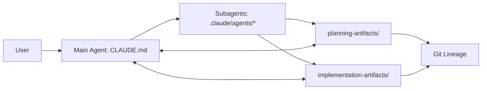

# Architecture

## 1. Purpose
This document describes the current architecture of the Context Engineering Template as implemented in this repository. It is a markdown-first, zero-runtime system that orchestrates multi-agent work via file-based protocols and durable artifacts.

## 2. System Context

### 2.1 Context Diagram (Logical)

### 2.2 External Dependencies
- Claude Code CLI (runtime for agent execution)
- Git (lineage and recovery)

No runtime services, databases, or external APIs are required by the template itself.

## 3. Architecture Overview

### 3.1 Core Components
- **Main Agent Kernel**: `CLAUDE.md` is a stateless dispatcher that reads file state, selects tasks, and delegates to subagents.
- **Subagents**: `.claude/agents/` implements specialized roles (researcher, planner, architect, implementer, reviewer, tester).
- **Skills**: `.claude/skills/` provides reusable rules and protocols (spec protocol, coding standards, testing strategy, architecture principles).
- **Artifacts**:
  - `planning-artifacts/` for project decisions, plans, specs, research, and continuity state.
  - `implementation-artifacts/` for implementation notes, reviews, and test evidence.

### 3.2 Data and State Model
State is file-based. The system treats file artifacts as the durable source of truth, not the conversation context. Git provides historical recovery and checkpointing.

## 4. Operational Flow

### 4.1 Dispatch Loop (Kernel)
The Main Agent executes a fixed loop:
1. Read state from TaskList and artifacts.
2. Select the next unblocked task.
3. Match the best agent.
4. Classify complexity and choose model (and spec tier if SDD is active).
5. Dispatch with context and a Trace ID.
6. Process results and update artifacts.
7. Periodically compact context and persist summaries.

### 4.2 Dynamic Coding Standards Loader
Before the main dispatch loop begins, Step 0 (Standards Check) triggers the coding standards loader if `planning-artifacts/coding-standards-resolved.md` is missing or stale (generated date ≠ today). The loader:
1. Detects the project stack (manifests, file extensions, CLAUDE.md `stack:` field) → writes `detected-stack.json`
2. Resolves sources from `coding-standards-sources.yaml` (local files + `.claude/standards-cache/` for remotes)
3. Merges rules by trust priority (override > verified > community) → writes `coding-standards-resolved.md`
4. Extracts a compressed summary (≤400 tokens) → writes `coding-standards-summary.md` (on the compaction keep-list)

The loader is offline-capable: remote fetching is delegated to a one-time researcher dispatch or manual cache population. If the registry is missing, the loader writes a warning and does not block dispatch.

### 4.3 SDD Mode (Spec-Driven Development)
SDD is opt-in via the presence of `.claude/skills/spec-protocol.md`. In SDD mode:
- Specs are embedded inline in task descriptions (no extra file reads).
- The planner authors spec packets and, for larger work, a spec overview document.
- Implementers report evidence per assertion.
- Review and testing follow structured verification rules.

## 5. Key Architectural Decisions (Current)
- **Markdown-first, zero-runtime**: All behavior is encoded in markdown and file conventions.
- **Stateless dispatcher**: No durable state held in agent memory.
- **File system as memory**: Planning/implementation artifacts carry state across sessions.
- **Spec packets inline**: Reduce context load and enforce a single source of truth.
- **Agent specialization**: Roles are separated; each writes only its artifacts.

## 6. Constraints and Quality Gates
- Kernel file size constraint for `CLAUDE.md`.
- Controlled vocabulary for requirement assertions.
- 7x7 structural constraint (max 7 tasks per feature, max 7 assertions per task).
- Reviewer protocol: status + severity + actionable fixes.
- Circuit breaker limits on review loops and dispatch retries.

## 7. Extension Points
- **Skills**: Add or refine protocols in `.claude/skills/`.
- **Agents**: Add new agents or extend existing agent rules.
- **Spec templates**: Optional `.claude/spec-templates/` for common patterns.
- **Knowledge base**: Failure patterns and research notes under planning artifacts.
- **Coding standards**: Add language entries to `coding-standards-sources.yaml`; place project overrides in `.claude/skills/overrides/`.

## 8. Known Risks
- Overgrowth of artifacts without periodic curation.
- Spec governance overhead if not applied consistently.
- Drift between documented process and actual usage patterns.

## 9. References (Local)
- `README.md`
- `CLAUDE.md`
- `internal_project_documentation/planning-artifacts/epics.md`
- `internal_project_documentation/brainstorming/brainstorming-session-2026-02-17.md`
- `internal_project_documentation/brainstorming/brainstorming-session-2026-02-21.md`
- `internal_project_documentation/brainstorming/brainstorming-session-2026-02-23.md`
